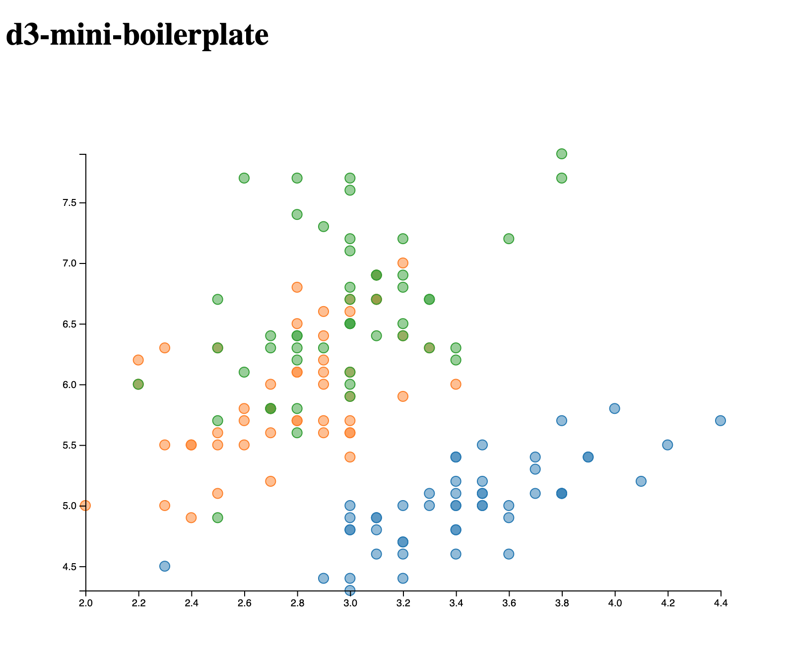

# d3-mini-boilerplate

Basic d3 + Babel + Webpack boilerplate that supports

- d3 v5
- ES6 (Babel)
- dev server (Webpack)


## Build and run

Install dependencies

```sh
yarn install
```

Run dev server

```sh
yarn start
```

Production build:

```sh
yarn build
```


## Demo screenshot

